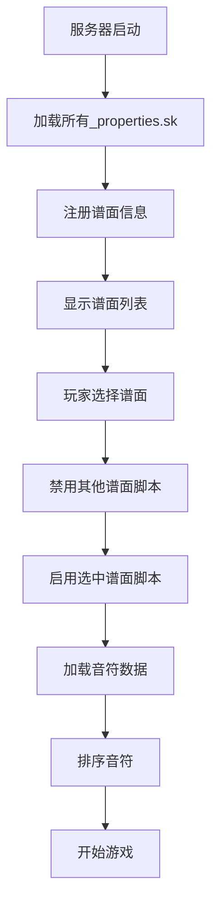

# CubeRhythm 铺面加载流程说明

## 目录
1. [加载流程概述](#加载流程概述)
2. [脚本加载机制](#脚本加载机制)
3. [谱面注册流程](#谱面注册流程)
4. [播放加载流程](#播放加载流程)
5. [JSON格式的加载配置](#json格式的加载配置)
6. [错误处理与优化](#错误处理与优化)

---

## 加载流程概述

### 系统架构



**JSON流程描述**:
```json
{
  "loadingPipeline": {
    "phases": [
      {
        "phase": 1,
        "name": "初始化",
        "trigger": "服务器启动/reload",
        "actions": [
          "加载所有*_properties.sk文件",
          "注册谱面到{loadedCharts}",
          "存储谱面元数据"
        ]
      },
      {
        "phase": 2,
        "name": "选择谱面",
        "trigger": "/play命令",
        "actions": [
          "显示谱面选择GUI",
          "读取玩家最佳成绩",
          "显示谱面详细信息"
        ]
      },
      {
        "phase": 3,
        "name": "加载谱面",
        "trigger": "点击谱面",
        "actions": [
          "禁用所有谱面内容脚本",
          "启用选中的谱面脚本",
          "加载音符到内存"
        ]
      },
      {
        "phase": 4,
        "name": "数据处理",
        "trigger": "/start命令",
        "actions": [
          "排序音符",
          "重组数据结构",
          "应用时间偏移"
        ]
      },
      {
        "phase": 5,
        "name": "开始播放",
        "trigger": "数据处理完成",
        "actions": [
          "播放音频",
          "启动渲染循环",
          "开始判定检测"
        ]
      }
    ]
  }
}
```

---

## 脚本加载机制

### 1. 服务器启动时

**位置**: `gui.sk` 第15-16行

```skript
on load:
    set {loaded} to true
```

**所有*_properties.sk文件自动执行**:
```skript
on load:
    registerChart("simpletone", "simpletone", "&bTutorial 1", "CRE", "PiraTom", 51, 0)
    setBPM("simpletone", 130)
```

**JSON等效配置**:
```json
{
  "serverStartup": {
    "autoLoad": true,
    "scripts": [
      {
        "type": "properties",
        "pattern": "*_properties.sk",
        "location": "plugins/Skript/scripts/charts/",
        "action": "auto_execute_on_load"
      },
      {
        "type": "content",
        "pattern": "*.sk",
        "excludePattern": "-*.sk",
        "action": "disabled_by_default"
      }
    ],
    "globalVariable": {
      "loaded": true,
      "description": "标记系统已初始化"
    }
  }
}
```

### 2. 谱面内容脚本状态

**默认状态**: 禁用（文件名前缀 `-`）

**文件命名规则**:
- 启用: `simpletone.sk`
- 禁用: `-simpletone.sk`

**JSON配置**:
```json
{
  "scriptStates": {
    "properties": {
      "namingPattern": "*_properties.sk",
      "defaultState": "enabled",
      "reason": "需要在启动时注册谱面"
    },
    "content": {
      "namingPattern": {
        "enabled": "*.sk",
        "disabled": "-*.sk"
      },
      "defaultState": "disabled",
      "reason": "避免同时加载多个谱面占用内存",
      "loadTiming": "on_demand"
    }
  }
}
```

---

## 谱面注册流程

### 1. registerChart 函数

**位置**: `gui.sk` 第67-74行

```skript
function registerChart(id, name, level, artist, author, length, offset):
    add {_id} to {loadedCharts::id::*}
    add {_name} to {loadedCharts::name::*}
    add {_level} to {loadedCharts::level::*}
    add {_artist} to {loadedCharts::artist::*}
    add {_author} to {loadedCharts::author::*}
    set {length::%{_id}%} to {_length}
    set {chartOffset::%{_id}%} to {_offset}
```

**JSON数据结构**:

**输入**:
```json
{
  "registerInput": {
    "id": "simpletone",
    "name": "simpletone",
    "level": "&bTutorial 1",
    "artist": "CRE",
    "author": "PiraTom",
    "length": 51,
    "offset": 0
  }
}
```

**存储结果**:
```json
{
  "loadedCharts": {
    "id": ["simpletone", "Sikkunt_Hardbeat", "styx_helix"],
    "name": ["simpletone", "Sikkunt Hardbeat", "Styx Helix"],
    "level": ["&bTutorial 1", "&615", "&918"],
    "artist": ["CRE", "Infected Mushroom", "MYTH & ROID"],
    "author": ["PiraTom", "EroslonDusk", "EroslonDusk"]
  },
  "length": {
    "simpletone": 51,
    "Sikkunt_Hardbeat": 240,
    "styx_helix": 195
  },
  "chartOffset": {
    "simpletone": 0,
    "Sikkunt_Hardbeat": 150,
    "styx_helix": -200
  }
}
```

### 2. setBPM 函数

**位置**: `gui.sk` 第76-77行

```skript
function setBPM(id, bpm):
    set {bpm::%{_id}%} to {_bpm}
```

**JSON存储**:
```json
{
  "bpm": {
    "simpletone": 130,
    "Sikkunt_Hardbeat": 200,
    "styx_helix": 180
  }
}
```

---

## 播放加载流程

### 1. playChart 函数完整流程

**位置**: `gui.sk` 第18-49行

**步骤详解**:

#### 第1步: 初始化

```skript
set {noteID} to 0
set {process} to 0
delete {editorSave::*} if {editMode} is true
```

**JSON**:
```json
{
  "step1_init": {
    "noteID": 0,
    "process": 0,
    "actions": [
      "重置音符ID计数器",
      "重置加载进度",
      "清除编辑器数据（如果在编辑模式）"
    ]
  }
}
```

#### 第2步: 禁用其他谱面

```skript
create section stored in {_sync}:
    loop enabled scripts:
        loop-value start with "charts"
        if loop-value contains "_properties":
            set {_null} to ""  # 跳过properties文件
        else:
            disable script loop-value  # 禁用其他谱面
    quitGame() if {editMode} is not true
run section {_sync} sync and wait
```

**JSON**:
```json
{
  "step2_disable": {
    "mode": "sync",
    "blocking": true,
    "actions": [
      {
        "action": "loop_enabled_scripts",
        "filter": "starts_with_'charts'"
      },
      {
        "action": "skip",
        "condition": "contains_'_properties'"
      },
      {
        "action": "disable",
        "target": "all_other_chart_content_scripts"
      },
      {
        "action": "quit_game",
        "condition": "not_in_edit_mode"
      }
    ]
  }
}
```

#### 第3步: 启用选中谱面

```skript
wait 1 tick
set {process} to 10
create section stored in {_async}:
    enable script "charts\-%{_id}%"
run section {_async} async and wait
```

**JSON**:
```json
{
  "step3_enable": {
    "progress": 10,
    "mode": "async",
    "blocking": true,
    "script": "charts\\-{chartID}",
    "description": "启用选中的谱面脚本，触发其on load事件"
  }
}
```

#### 第4步: 音符数据加载

**谱面脚本的 on load 事件**:
```skript
on load:
    delete {loadedNotes::*}
    set {maxNote} to 0
    set {sound} to "cr.simpletone"
    loadChart()
```

**loadChart() 函数调用所有音符函数**:
```skript
function loadChart():
    execution(0, {title1})
    tap(14.77, "w", 1, 0, false, "")
    hold(29.55, "w", 2, 1, false, "")
    # ... 更多音符
```

**JSON等效**:
```json
{
  "step4_load_notes": {
    "phase": "on_load_event",
    "actions": [
      {
        "action": "clear_notes",
        "variable": "{loadedNotes::*}"
      },
      {
        "action": "reset_counter",
        "variable": "{maxNote}",
        "value": 0
      },
      {
        "action": "set_audio",
        "variable": "{sound}",
        "value": "cr.simpletone"
      },
      {
        "action": "call_function",
        "function": "loadChart"
      }
    ],
    "loadChart": {
      "description": "遍历所有音符定义",
      "mechanism": "call_note_functions",
      "storage": "{loadedNotes::*}",
      "noteTypes": ["execution", "tap", "hold", "drag", "flick", "double"]
    }
  }
}
```

#### 第5步: 编辑器/游戏模式分支

**编辑器模式**:
```skript
if {editMode} is true:
    set {editor::bpm} to {bpm::%{_id}%}
    set {editor::tick} to 0
    set {editor::preTime} to 0
    addTick({actor}, 0)
    delete {process}
    send title "" with subtitle "&a谱面已读取完毕"
```

**JSON**:
```json
{
  "step5_editor_mode": {
    "condition": "{editMode} === true",
    "actions": [
      {"set": "{editor::bpm}", "from": "{bpm::{chartID}}"},
      {"set": "{editor::tick}", "value": 0},
      {"set": "{editor::preTime}", "value": 0},
      {"call": "addTick", "args": ["{actor}", 0]},
      {"delete": "{process}"},
      {"display": "谱面已读取完毕"}
    ]
  }
}
```

**游戏模式**:
```skript
else:
    set {process} to 25
    set {playing} to {_id}
    wait 0.5 seconds
    execute {actor} command "start"
```

**JSON**:
```json
{
  "step5_game_mode": {
    "condition": "{editMode} !== true",
    "actions": [
      {"set": "{process}", "value": 25},
      {"set": "{playing}", "value": "{chartID}"},
      {"wait": 0.5, "unit": "seconds"},
      {"execute_command": "/start", "executor": "{actor}"}
    ],
    "next": "进入/start命令流程"
  }
}
```

---

## /start 命令流程

**位置**: `main.sk` 第225-291行

### 完整流程JSON描述

```json
{
  "startCommand": {
    "trigger": "/start",
    "phases": [
      {
        "phase": 1,
        "name": "准备阶段",
        "progress": "50%",
        "actions": [
          {"set": "{process}", "value": 50},
          {"wait": "1 tick"}
        ]
      },
      {
        "phase": 2,
        "name": "音符排序",
        "progress": "50-75%",
        "mode": "async",
        "blocking": true,
        "process": {
          "step1": "获取所有音符的时间索引",
          "step2": "按时间升序排序",
          "step3": "创建新的顺序索引",
          "step4": "复制所有音符属性",
          "progressFormula": "count / (noteID * 13) * 50 + 50"
        },
        "details": {
          "sortBy": "time",
          "order": "ascending",
          "properties": [
            "type", "time", "face", "x", "y",
            "x1", "y1", "x2", "y2",
            "turn", "glowing", "section", "tag"
          ],
          "propertiesCount": 13
        }
      },
      {
        "phase": 3,
        "name": "数据重组",
        "progress": "75-100%",
        "process": {
          "step1": "删除{loadedNotes::*}",
          "step2": "从{_sorted::*}复制到{loadedNotes::*}",
          "step3": "转换为顺序索引结构",
          "progressFormula": "count / (noteID * 13) * 50 + 50"
        },
        "before": {
          "structure": "scattered_key_value",
          "example": "{loadedNotes::time::5} = 14.77"
        },
        "after": {
          "structure": "sequential_index",
          "example": "{loadedNotes::time::1} = 14.77"
        }
      },
      {
        "phase": 4,
        "name": "显示信息",
        "progress": "100%",
        "actions": [
          {"delete": "{process}"},
          {
            "display_title": {
              "main": "{song}",
              "subtitle": "曲: {artist} · 谱: {author}",
              "duration": 1,
              "fadeIn": 0.5,
              "fadeOut": 0.5
            }
          },
          {"play_sound": "{sound}", "target": "all_players"}
        ]
      },
      {
        "phase": 5,
        "name": "UI初始化",
        "wait": "2 seconds",
        "actions": [
          {"set": "{actor}", "value": "player"},
          {"stop_sounds": "all_players"},
          {
            "fill_hotbar": {
              "slots": "0-8",
              "item": "snowball",
              "name": "&f"
            }
          }
        ]
      },
      {
        "phase": 6,
        "name": "游戏状态初始化",
        "variables": {
          "{timer}": 0,
          "{combo}": 0,
          "{score}": 0,
          "{beat}": -8,
          "{hitNotes}": 0,
          "{alphaTime}": 11,
          "{statistics::exact}": 0,
          "{statistics::just}": 0,
          "{statistics::miss}": 0,
          "{statistics::exactHold}": 0
        }
      },
      {
        "phase": 7,
        "name": "时间偏移应用",
        "process": "loop_all_notes",
        "offsets": [
          {
            "type": "global",
            "value": 3,
            "unit": "seconds",
            "reason": "给玩家准备时间"
          },
          {
            "type": "player",
            "value": "{offset::{playerUUID}}",
            "unit": "milliseconds",
            "reason": "玩家自定义偏移"
          },
          {
            "type": "chart",
            "value": "{chartOffset::{playing}}",
            "unit": "milliseconds",
            "reason": "谱面固有偏移"
          }
        ],
        "formula": "noteTime += 3 + playerOffset*0.001 + chartOffset*0.001"
      },
      {
        "phase": 8,
        "name": "开始播放",
        "wait": "3 seconds",
        "actions": [
          {"play_sound": "{sound}", "target": "all_players"},
          {"start_loop": "render_loop"}
        ]
      }
    ]
  }
}
```

### 排序前后数据对比

**排序前**:
```json
{
  "loadedNotes": {
    "type": {
      "8": "tap",
      "2": "hold",
      "15": "drag",
      "5": "tap"
    },
    "time": {
      "8": 20.31,
      "2": 14.77,
      "15": 42.46,
      "5": 16.61
    }
  }
}
```

**排序后**:
```json
{
  "loadedNotes": {
    "type": {
      "1": "tap",
      "2": "tap",
      "3": "tap",
      "4": "hold",
      "5": "drag"
    },
    "time": {
      "1": 17.77,
      "2": 19.61,
      "3": 23.31,
      "4": 32.55,
      "5": 45.46
    }
  },
  "note": "时间已应用偏移（+3秒全局偏移）"
}
```

---

## JSON格式的加载配置

### 完整加载配置Schema

```json
{
  "loadConfig": {
    "version": "1.0.0",
    "paths": {
      "chartDirectory": "plugins/Skript/scripts/charts/",
      "propertiesPattern": "*_properties.sk",
      "contentPattern": "*.sk",
      "disabledPrefix": "-"
    },
    "loadingPhases": {
      "serverStart": {
        "autoLoad": ["*_properties.sk"],
        "registerFunction": "registerChart",
        "globalVariables": [
          "{loadedCharts::id::*}",
          "{loadedCharts::name::*}",
          "{loadedCharts::level::*}",
          "{loadedCharts::artist::*}",
          "{loadedCharts::author::*}",
          "{length::*}",
          "{chartOffset::*}",
          "{bpm::*}"
        ]
      },
      "chartSelection": {
        "trigger": "/play",
        "gui": "infoGUI",
        "displayData": [
          "name", "level", "artist", "author",
          "duration", "bpm", "bestScore"
        ]
      },
      "chartLoad": {
        "trigger": "click_chart",
        "function": "playChart",
        "steps": [
          "disable_other_charts",
          "enable_selected_chart",
          "load_notes",
          "start_game_or_editor"
        ]
      },
      "gameStart": {
        "trigger": "/start",
        "steps": [
          "sort_notes",
          "reorganize_data",
          "display_info",
          "init_ui",
          "init_game_state",
          "apply_offsets",
          "start_playback"
        ]
      }
    },
    "progressTracking": {
      "enabled": true,
      "variable": "{process}",
      "stages": {
        "init": 0,
        "disabling_scripts": 10,
        "enabling_script": 25,
        "sorting": "50-75",
        "reorganizing": "75-100",
        "complete": "delete"
      },
      "display": {
        "type": "subtitle",
        "format": "&8{seconds} {bar} {seconds}",
        "updateRate": "every_tick"
      }
    },
    "memoryManagement": {
      "clearOnLoad": [
        "{loadedNotes::*}",
        "{editorSave::*}",
        "{maxNote}"
      ],
      "clearOnFinish": [
        "{process}",
        "{_sorted::*}",
        "{_async}",
        "{_sync}"
      ]
    }
  }
}
```

---

## 错误处理与优化

### 1. 刷新机制

**位置**: `gui.sk` 第51-65行

```skript
function refresh(p):
    delete {loadedCharts::*}
    delete {length::*}
    delete {chartOffset::*}
    # 禁用所有properties
    # 重新启用所有properties
    # 重新打开GUI
```

**JSON**:
```json
{
  "refreshMechanism": {
    "trigger": "点击刷新按钮",
    "purpose": "重新加载谱面配置",
    "steps": [
      {
        "step": 1,
        "action": "clear_registry",
        "variables": [
          "{loadedCharts::*}",
          "{length::*}",
          "{chartOffset::*}"
        ]
      },
      {
        "step": 2,
        "action": "disable_properties",
        "pattern": "charts/*_properties.sk"
      },
      {
        "step": 3,
        "wait": "1 tick"
      },
      {
        "step": 4,
        "action": "enable_properties",
        "pattern": "charts/*_properties.sk",
        "effect": "触发on load重新注册"
      },
      {
        "step": 5,
        "wait": "5 ticks"
      },
      {
        "step": 6,
        "action": "reopen_gui"
      }
    ],
    "note": "此操作不会重载谱面内容脚本"
  }
}
```

### 2. 防止重复加载

**机制**:
```skript
if {actor} is not set:
    # 允许打开GUI
else:
    send "&c游戏期间不可打开面板！"
```

**JSON**:
```json
{
  "duplicateLoadPrevention": {
    "check": "{actor} is not set",
    "allow": "打开GUI和加载谱面",
    "deny": {
      "message": "游戏期间不可打开面板",
      "reason": "防止在游戏中加载新谱面导致冲突"
    }
  }
}
```

### 3. 编辑模式隔离

**代码**:
```skript
delete {editorSave::*} if {editMode} is true
quitGame() if {editMode} is not true
```

**JSON**:
```json
{
  "editorModeIsolation": {
    "editMode": {
      "storage": "{editorSave::*}",
      "clearOnLoad": true,
      "skipQuitGame": true,
      "additionalSetup": [
        "set {editor::bpm}",
        "set {editor::tick}",
        "addTick()"
      ]
    },
    "gameMode": {
      "storage": "{loadedNotes::*}",
      "quitGameBefore": true,
      "executeStart": true
    }
  }
}
```

### 4. 异步加载优化

**代码**:
```skript
create section stored in {_async}:
    enable script "charts\-%{_id}%"
run section {_async} async and wait
```

**JSON**:
```json
{
  "asyncOptimization": {
    "mechanism": "async_section",
    "blocking": true,
    "benefits": [
      "不阻塞主游戏循环",
      "避免加载卡顿",
      "等待完成后再继续"
    ],
    "usage": {
      "scriptEnabling": "async",
      "noteSorting": "async",
      "reason": "这些操作可能耗时较长"
    }
  }
}
```

---

## 加载时间分析

### 预估加载时间

```json
{
  "loadingTime": {
    "phases": [
      {
        "phase": "禁用其他谱面",
        "time": "0.05-0.1s",
        "depends": "已启用的谱面数量"
      },
      {
        "phase": "启用选中谱面",
        "time": "0.1-0.5s",
        "depends": "音符数量"
      },
      {
        "phase": "音符注册",
        "time": "0.05-0.2s",
        "depends": "音符数量"
      },
      {
        "phase": "音符排序",
        "time": "0.1-1.0s",
        "depends": "音符数量",
        "complexity": "O(n log n)"
      },
      {
        "phase": "数据重组",
        "time": "0.1-0.5s",
        "depends": "音符数量"
      },
      {
        "phase": "显示信息",
        "time": "2.0s",
        "fixed": true,
        "reason": "等待动画"
      },
      {
        "phase": "准备时间",
        "time": "3.0s",
        "fixed": true,
        "reason": "玩家准备"
      }
    ],
    "total": {
      "min": "5.4s",
      "typical": "6.0s",
      "max": "7.5s",
      "notes": "基于1000个音符的谱面"
    }
  }
}
```

---

## 内存占用分析

### 音符数据占用

```json
{
  "memoryUsage": {
    "perNote": {
      "properties": 13,
      "bytes": "约100-200字节",
      "variables": [
        "type", "time", "face", "x", "y",
        "x1", "y1", "x2", "y2",
        "turn", "glowing", "section", "tag"
      ]
    },
    "examples": {
      "small": {
        "notes": 100,
        "memory": "10-20 KB"
      },
      "medium": {
        "notes": 500,
        "memory": "50-100 KB"
      },
      "large": {
        "notes": 2000,
        "memory": "200-400 KB"
      }
    },
    "optimization": {
      "current": "排序后删除原数据",
      "benefit": "避免双倍内存占用",
      "jsonFormat": {
        "advantage": "结构化存储",
        "compression": "可压缩",
        "streaming": "支持流式加载"
      }
    }
  }
}
```

---

## 未来JSON格式改进建议

```json
{
  "improvements": {
    "lazyLoading": {
      "description": "分段加载谱面",
      "mechanism": "仅加载未来30秒的音符",
      "benefit": "减少内存占用和加载时间"
    },
    "caching": {
      "description": "缓存已排序的谱面",
      "format": "预处理的二进制格式",
      "benefit": "跳过排序步骤"
    },
    "validation": {
      "description": "JSON Schema验证",
      "timing": "加载前",
      "benefit": "提前发现格式错误"
    },
    "compression": {
      "description": "压缩JSON文件",
      "format": "gzip",
      "benefit": "减少磁盘占用和加载时间"
    },
    "incremental": {
      "description": "增量更新",
      "mechanism": "仅重新加载修改的谱面",
      "benefit": "加快刷新速度"
    }
  }
}
```

---

## 附录：加载相关变量说明

### 全局变量

```json
{
  "globalVariables": {
    "{loaded}": {
      "type": "boolean",
      "purpose": "标记系统已初始化",
      "setBy": "gui.sk on load"
    },
    "{loadedCharts::id::*}": {
      "type": "list",
      "purpose": "所有谱面的ID列表",
      "example": ["simpletone", "Sikkunt_Hardbeat"]
    },
    "{loadedCharts::name::*}": {
      "type": "list",
      "purpose": "谱面显示名称"
    },
    "{loadedCharts::level::*}": {
      "type": "list",
      "purpose": "难度等级"
    },
    "{loadedCharts::artist::*}": {
      "type": "list",
      "purpose": "作曲家"
    },
    "{loadedCharts::author::*}": {
      "type": "list",
      "purpose": "谱师"
    },
    "{length::{chartID}}": {
      "type": "number",
      "unit": "seconds",
      "purpose": "谱面时长"
    },
    "{chartOffset::{chartID}}": {
      "type": "number",
      "unit": "milliseconds",
      "purpose": "谱面时间偏移"
    },
    "{bpm::{chartID}}": {
      "type": "number",
      "purpose": "每分钟节拍数"
    }
  }
}
```

### 临时变量

```json
{
  "temporaryVariables": {
    "{process}": {
      "type": "number",
      "range": "0-100",
      "purpose": "加载进度百分比",
      "lifecycle": "加载期间"
    },
    "{loadingTime}": {
      "type": "number",
      "unit": "ticks",
      "purpose": "加载耗时计数",
      "display": "进度条两侧"
    },
    "{_sync}": {
      "type": "section",
      "purpose": "同步执行的代码段"
    },
    "{_async}": {
      "type": "section",
      "purpose": "异步执行的代码段"
    },
    "{_sorted::*}": {
      "type": "map",
      "purpose": "排序后的临时数据",
      "lifecycle": "排序到重组之间"
    }
  }
}
```

---

## 版本历史

- **v1.0.0** (2025-10-26)
  - 初始版本
  - 完整的加载流程说明
  - JSON格式配置示例
  - 性能分析和优化建议
